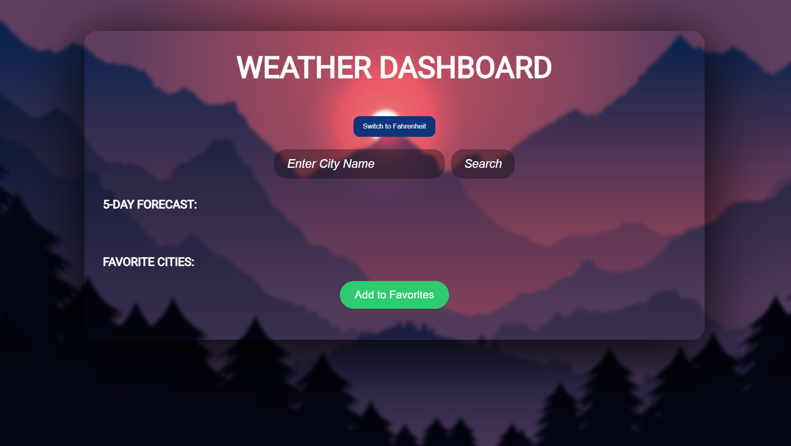

# Weather Dashboard

The Weather Dashboard is a React-based web application that provides users with current weather conditions and a 5-day weather forecast for any city worldwide. The app allows users to manage a list of favorite cities and toggle between Celsius and Fahrenheit for temperature display.

## Features

- **Search Functionality**: Enter the name of a city to view its current weather and a 5-day forecast.
- **Temperature Toggle**: Switch between Celsius and Fahrenheit for temperature display.
- **Favorites Management**: Add cities to favorites and view their weather information easily.
- **Responsive Design**: The application is fully responsive, offering a seamless experience across devices.

## Technologies Used

- **Frontend**: React.js, Axios
- **Styling**: CSS3 (with modern design principles)
- **API**: OpenWeatherMap API
- **Backend**: JSON Server (for managing favorite cities)
- **Build Tool**: Vite

## Screenshots



## Getting Started

### Prerequisites

1. **Node.js**: Make sure you have Node.js installed on your machine. You can download it from [nodejs.org](https://nodejs.org/).

2. **API Key**: Register on [OpenWeatherMap](https://openweathermap.org/) and obtain an API key to access weather data.

### Installation

1. **Clone the repository**:

   ```bash
   git clone https://github.com/your-username/weather-dashboard.git
   cd weather-dashboard


Usage
Search for a City: Type the name of a city in the search bar and press the "Search" button.
Toggle Temperature Unit: Use the toggle to switch between Celsius and Fahrenheit.
Add to Favorites: After searching, click the "Add to Favorites" button to save the city for easy access later.
View Favorite Cities: Scroll down to see your list of favorite cities and their weather details.
